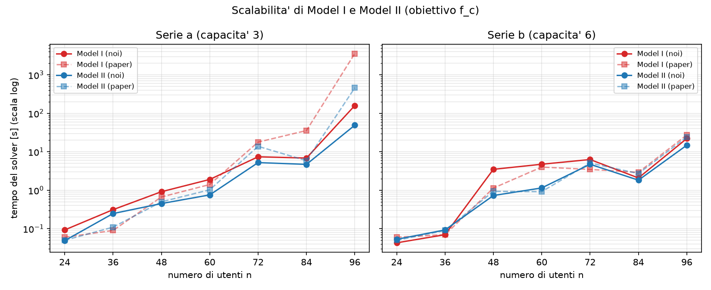
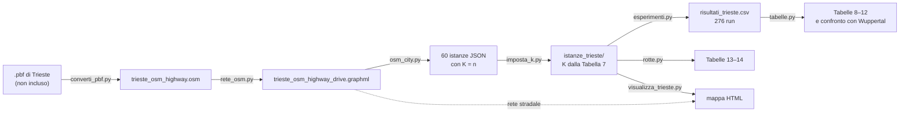

# Modelli MILP event-based per il ridepooling

Progetto d'esame di **Math Opti 2026**. Il repository contiene l'implementazione in Python e Gurobi dei due modelli MILP *event-based* per il Dial-a-Ride Problem (DARP) proposti in:

> D. Gaul, K. Klamroth, M. Stiglmayr (2022). *Event-based MILP models for ridepooling applications*. European Journal of Operational Research, 301(3). DOI: [10.1016/j.ejor.2021.11.053](https://doi.org/10.1016/j.ejor.2021.11.053)

Il lavoro è diviso in due parti:

1. **Replica sulle istanze benchmark di Cordeau.** Model I e Model II risolvono all'ottimo le istanze delle Tabelle 5 e 6 del paper e ne ritrovano i costi pubblicati (`test.py`, `scalability.py`).
2. **Caso di studio su Trieste.** Seguendo la ricetta del caso Wuppertal (Sez. 4.2 del paper) abbiamo generato 60 istanze sulla rete stradale reale di Trieste (OpenStreetMap), le abbiamo risolte con le sei funzioni obiettivo del paper e abbiamo confrontato le tendenze con quelle pubblicate per Wuppertal (Tabelle 8–14).

**Autori:** Giovanni Bernobic, Alessandro De Nardo

---

## Indice

- [Il problema in breve](#il-problema-in-breve)
- [Struttura del repository](#struttura-del-repository)
- [Requisiti e installazione](#requisiti-e-installazione)
- [Avvio rapido](#avvio-rapido)
- [Parte 1: istanze Cordeau](#parte-1-istanze-cordeau)
- [Parte 2: caso di studio Trieste](#parte-2-caso-di-studio-trieste)
- [Risultati principali](#risultati-principali)
- [Scelte implementative e differenze rispetto al paper](#scelte-implementative-e-differenze-rispetto-al-paper)
- [Usare i moduli da Python](#usare-i-moduli-da-python)
- [Formato dei file](#formato-dei-file)
- [Riferimenti e licenze dei dati](#riferimenti-e-licenze-dei-dati)

---

## Il problema in breve

**Il DARP.** Una flotta di `K` veicoli con `Q` posti ciascuno parte da un deposito e deve servire `n` richieste di trasporto. Ogni richiesta `i` ha:

- un punto di salita (*pickup*, `i+`) e uno di discesa (*drop-off*, `i−`);
- una finestra temporale `[e, l]` per ciascuno dei due punti;
- un numero di posti `q_i` e un tempo di servizio `s_i`;
- un tempo massimo di permanenza a bordo `L_i` (*ride time*).

Tutti i veicoli devono rientrare al deposito entro l'orizzonte `T`.

**Il grafo event-based.** Invece di un grafo geografico, il paper costruisce un grafo i cui nodi sono *stati di occupazione del veicolo* subito dopo un evento (una salita o una discesa). Ogni nodo è una tupla di lunghezza `Q`:

- la prima componente è l'ultimo evento: `+i` se l'utente `i` è appena salito, `−i` se è appena sceso;
- le altre componenti sono gli utenti ancora a bordo, in ordine decrescente, con `0` per i posti liberi.

Esempio con `Q = 3`: il nodo `(+2, 5, 0)` significa "è appena salito l'utente 2, a bordo c'è già l'utente 5, resta un posto libero". Il deposito è `(0, 0, 0)`.

Con questa codifica diversi vincoli del DARP sono già nel grafo e non servono righe nel modello:

- **capacità:** diventano nodi solo le tuple che rispettano i posti disponibili;
- **abbinamento e precedenza:** gli archi (famiglie A1–A6) collegano solo stati consecutivi coerenti, per cui ogni utente scende dopo essere salito e dallo stesso veicolo;
- **coppie incompatibili:** due utenti che non possono stare a bordo insieme rispettando finestre e ride time vengono esclusi in anticipo dalle funzioni di fattibilità `f1` e `f2`.

Una soluzione è un insieme di cammini dal deposito al deposito, uno per veicolo. Le variabili sono `x_a ∈ {0, 1}` per ogni arco e `B_v`, l'istante di inizio servizio, per ogni nodo.

**Model I e Model II.** I due modelli usano lo stesso grafo e le stesse variabili e differiscono nel modo di imporre il ride time massimo:

- **Model I** lo impone con vincoli big-M scritti sugli archi;
- **Model II** lo riformula come finestre temporali sui nodi, e così riduce drasticamente il numero di vincoli che contengono somme sugli archi.

I due modelli sono equivalenti (stesso ottimo), ma Model II è in genere più veloce. Per questo il paper lo usa, e anche noi, nel caso di studio.

**Le funzioni obiettivo** (Sez. 3.5 del paper) sono somme pesate di quattro criteri:

| Obiettivo | Formula | Significato |
|---|---|---|
| `fc` | costo | distanza totale percorsa dai veicoli |
| `fn` | rifiuti | numero di richieste rifiutate |
| `fr` | Σ d_i | regret totale |
| `frmax` | max d_i | regret massimo (equità) |
| `fcr` | costo + α·Σ d_i | costo e regret totale |
| `fcrmax` | costo + β·max d_i | costo e regret massimo |
| `frcr` | costo + α·Σ d_i + γ·rifiuti | costo, regret e rifiuti (le richieste si possono rifiutare) |

Il **regret** `d_i` è il ritardo con cui l'utente `i` arriva a destinazione rispetto al primo istante possibile, cioè `d_i = B_{i−} − e_{i−}` con `e_{i−} = e_{i+} + s_i + t_i`, dove `t_i` è il tempo del viaggio diretto. I pesi sono quelli del paper: α = 1, β = n/5, γ = 20.

---

## Struttura del repository

```
MathOpti2026/
├── README.md
├── requirements.txt
│
│   Nucleo del modello (Parte 1 e Parte 2)
├── instances.py            lettura delle istanze: Cordeau (.txt) e OSM (.json)
├── graph.py                grafo event-based: nodi, f1/f2, archi A1–A6, schedule minimo
├── model.py                Model I e Model II in gurobipy (obiettivo f_c)
├── objectives.py           le sette funzioni obiettivo del paper
├── results.py              risoluzione, rotte, criteri, controlli di coerenza
├── test.py                 validazione su istanze piccole
├── scalability.py          scalabilità di Model I e Model II
│
│   Caso di studio Trieste (Parte 2)
├── converti_pbf.py         estratto .pbf → file .osm con le sole strade (pyosmium)
├── rete_osm.py             file .osm → grafo stradale carrabile (GraphML)
├── osm_city.py             GraphML → 60 istanze JSON (ricetta del caso Wuppertal)
├── imposta_k.py            numero di veicoli di ogni istanza dalla Tabella 7 del paper
├── esperimenti.py          276 run (46 istanze × 6 obiettivi) → CSV dei risultati
├── tabelle.py              CSV → Tabelle 8–12 e confronto con Wuppertal
├── rotte.py                Tabelle 13–14: rotte dei veicoli di una singola istanza
├── visualizza_trieste.py   mappa interattiva HTML delle rotte sulla rete reale
│
│   Dati e risultati
├── dati_milp/              46 istanze Cordeau + a2-4 (istanza ridotta di prova)
├── istanze_trieste/        60 istanze Trieste in formato JSON
├── trieste_osm_highway.osm              strade di Trieste in formato OSM XML
├── trieste_osm_highway_drive.graphml    rete stradale di Trieste
└── risultati/
    ├── scalability.csv, scalability.png
    └── risultati_trieste.csv
```

I moduli del nucleo formano una catena: ognuno usa solo quelli che lo precedono.

```
instances.py → graph.py → model.py → objectives.py → results.py
```

`graph.py` non sa da quale formato arriva l'istanza: legge costi, tempi e ride time solo tramite `costo()`, `tempo()` e `ride_max()` di `Istanza`. Per questo lo stesso codice risolve sia le istanze Cordeau sia quelle di Trieste.

---

## Requisiti e installazione

- **Python 3.13** o successivo (sviluppato con 3.13, verificato anche con 3.14).
- **Gurobi 13** con una licenza valida. Il pacchetto `gurobipy` installato con pip include una licenza limitata ai modelli piccoli, non sufficiente per le istanze più grandi: serve una licenza completa (come la licenza accademica).

```bash
git clone https://github.com/Giovnn/MathOpti2026.git
cd MathOpti2026
python -m venv venv
venv\Scripts\activate            # Windows
source venv/bin/activate         # macOS / Linux
pip install -r requirements.txt
```

`osmium` (pyosmium), `osmnx` e `geopandas` servono solo per rigenerare la rete stradale e le istanze (`converti_pbf.py`, `rete_osm.py`, `osm_city.py`). Modelli, test, tabelle e mappa funzionano anche senza.

Tutti i comandi di questo README si lanciano **dalla cartella principale del repository**. Nei percorsi si può usare `/` anche su Windows.

---

## Avvio rapido

```bash
python test.py                     # validazione dei modelli (pochi secondi)
python scalability.py              # scalabilità Model I vs Model II (qualche minuto)

python tabelle.py risultati/risultati_trieste.csv --confronto
python rotte.py istanze_trieste/Trieste_Q3.20.5.json
python visualizza_trieste.py istanze_trieste/Trieste_Q3.20.*.json --rete trieste_osm_highway_drive.graphml
```

---

## Parte 1: istanze Cordeau

### Le istanze

La cartella `dati_milp/` contiene 46 istanze del benchmark di Cordeau (2006), nel formato descritto in [Formato dei file](#formato-dei-file):

- **serie a:** `Q = 3`, un posto per utente, `L = 30`;
- **serie b:** `Q = 6`, da 1 a 6 posti per utente, `L = 45`.

Il nome indica veicoli e richieste: `a3-24` ha 3 veicoli e 24 richieste. Il file `a2-4.txt` è un'istanza ridotta con 4 richieste, costruita da noi per le prove rapide.

In queste istanze costi e tempi coincidono con la distanza euclidea. Per ogni richiesta è data una sola finestra temporale; l'altra viene ricostruita con le equazioni (5)–(6) del paper. Il tipo della richiesta (inbound/outbound) si riconosce dall'ampiezza relativa delle due finestre.

### `test.py`: validazione su istanze piccole

```bash
python test.py
```

**Parte 1.** Model I e Model II minimizzano il costo `f_c` su sei istanze piccole. Per ognuna si verifica che:

- il solver dimostri l'ottimo;
- la soluzione superi i controlli di coerenza di `results.py`, cioè che l'obiettivo ricalcolato dalle rotte coincida con quello del solver;
- il costo coincida con le Tabelle 5 e 6 del paper, entro 0,1 (il paper riporta un decimale);
- i due modelli trovino lo stesso costo.

| Istanza | a2-16 | a3-18 | a4-16 | b2-16 | b3-18 | b4-16 |
|---|---|---|---|---|---|---|
| Costo del paper | 294,3 | 300,5 | 282,7 | 309,4 | 301,6 | 297,0 |

**Parte 2.** Sull'istanza `a2-16` si risolvono con entrambi i modelli le altre sei funzioni obiettivo (`fn`, `fr`, `frmax`, `fcr`, `fcrmax`, `frcr`). Il paper non riporta valori per queste combinazioni, quindi si verifica che i due modelli, equivalenti per costruzione, trovino lo stesso ottimo.

Il risultato atteso è:

```
RIEPILOGO: 48/48 controlli superati
```

I controlli sono 30 nella Parte 1 (6 istanze × 5 controlli) e 18 nella Parte 2 (6 obiettivi × 3 controlli).

### `scalability.py`: scalabilità di Model I e Model II

```bash
python scalability.py
```

Risolve con entrambi i modelli (obiettivo `f_c`) 14 istanze di dimensione crescente, da `a2-24` ad `a8-96` e da `b2-24` a `b8-96`. A ogni gradino si aggiungono 12 utenti e un veicolo, con `T = 720` minuti. Ogni run ha un time limit di 7200 s e un MIPGap di 1e-4. Il calcolo del solver richiede in tutto circa 5 minuti.

Lo script produce la tabella a schermo, `risultati/scalability.csv` e il grafico `risultati/scalability.png`.



I tempi non sono confrontabili in valore assoluto con quelli del paper, ottenuti con CPLEX 12.10 su un altro computer. Contano l'andamento al crescere delle istanze e quale dei due modelli è più veloce.

---

## Parte 2: caso di studio Trieste

Il paper verifica i suoi obiettivi su istanze generate sulla rete stradale di Wuppertal. Noi abbiamo applicato la stessa ricetta a Trieste, per vedere se le tendenze osservate si ripresentano in un'altra città.



> **Riproducibilità.** I prodotti dei passi 0–3 (file `.osm`, rete stradale e istanze) sono già nel repository, così come il CSV del passo 4. Per riprodurre tabelle, rotte e mappa si può partire direttamente dal passo 5.

### Passo 0: dati OpenStreetMap (`converti_pbf.py`)

Si parte dall'estratto comunale di Trieste in formato `.pbf`, preso da *Estratti OpenStreetMap Italia* (Wikimedia Italia). OSMnx costruisce grafi solo da file OSM XML (`graph_from_xml`), non dal formato binario `.pbf`. Per questo il primo passo converte l'estratto in XML, tenendo solo ciò che serve.

```bash
pip install osmium                      # pyosmium: su PyPI il pacchetto si chiama "osmium"
python converti_pbf.py trieste_osm.pbf  # produce trieste_osm_highway.osm
```

Lo script usa pyosmium, il binding Python della libreria libosmium, e lavora in tre fasi:

1. **Filtro.** Legge solo le way del `.pbf` e tiene quelle con tag `highway`, comprese le pedonali. La decisione su cosa sia percorribile in auto resta così in un solo punto del progetto, la funzione `arco_carrabile()` di `rete_osm.py`.
2. **Scrittura.** Scrive le way filtrate e poi rilegge il `.pbf` per aggiungere i nodi a cui fanno riferimento. Il formato di uscita (OSM XML) è scelto dall'estensione `.osm`.
3. **Verifica.** Controlla, con la sola libreria standard, che ogni nodo citato da una way sia presente nel file. Serve perché un estratto tagliato sul confine comunale può lasciare strade che citano nodi esterni: OSMnx creerebbe archi verso punti senza coordinate e fallirebbe nel calcolo delle lunghezze. Sull'estratto di Trieste i nodi mancanti sono risultati zero.

Il `.pbf` non è incluso nel repository, mentre il file prodotto, `trieste_osm_highway.osm`, sì. OpenStreetMap cambia nel tempo, quindi un estratto scaricato oggi darebbe una rete leggermente diversa. Partendo dal `.osm` del repository si lavora invece sugli stessi dati usati per il progetto, e si può ripartire direttamente dal passo 1.

### Passo 1: rete stradale (`rete_osm.py`)

```bash
python rete_osm.py trieste_osm_highway.osm
```

Il file `.osm` viene trasformato nel grafo carrabile in quattro fasi:

1. caricamento completo del file, senza semplificare;
2. rimozione degli archi non percorribili in auto, con la funzione `arco_carrabile()`: lista bianca dei tipi di strada, esclusi gli accessi vietati;
3. estrazione della componente fortemente connessa più grande, così ogni punto raggiunge ogni altro rispettando i sensi unici;
4. semplificazione, che toglie i nodi intermedi che non sono incroci.

Il risultato è `trieste_osm_highway_drive.graphml`, con 3 499 nodi e 7 679 archi, più due immagini: la rete finale e i nodi scartati dalla componente forte.

### Passo 2: generazione delle istanze (`osm_city.py`)

```bash
python osm_city.py trieste_osm_highway_drive.graphml <cartella_nuova>
python osm_city.py trieste_osm_highway_drive.graphml <cartella_nuova> prova   # una sola istanza, con dettagli
```

Il generatore segue la ricetta del paper. Dove il paper non specifica i dettagli, applica scelte nostre:

| Elemento | Valore | Origine |
|---|---|---|
| Gruppi di istanze | `Q ∈ {3, 6}`, `n ∈ {20, 30, 40, 60, 80, 100}`, 5 istanze per gruppo, 60 in tutto | paper |
| Orizzonte | `T = 240` minuti | paper |
| Velocità | 15 km/h, cioè 4 minuti per km | paper |
| Pickup | `e_{i+}` estratto da {5, 10, …, 205}, finestra di 15 minuti | paper |
| Posti e servizio | `Q = 3`: un posto; `Q = 6`: da 1 a 6 posti; `s_i = q_i` | paper |
| Ride time massimo | `L_i = 1,5 · t_i` | paper |
| Finestra di drop-off | equazione (5) del paper | paper |
| Deposito | Trieste Centrale: il nodo della rete più vicino a (45.657, 13.772) | nostra |
| Fermate | nodi di strade con nome di tipo primary, secondary, tertiary, unclassified, residential, living_street; si estrae una strada e poi un nodo lungo di essa | nostra |
| Distanza minima | pickup e drop-off distanti almeno 0,5 km su strada | nostra |
| Fattibilità | una richiesta che non si può servire da sola (deposito → pickup → drop-off → deposito entro finestre e `T`) viene ricampionata per intero; gli scarti sono registrati nel JSON | nostra |
| Costi | matrice in km dei cammini minimi sulla rete, asimmetrica per via dei sensi unici | — |

Ogni istanza ha un seed leggibile, per esempio `Trieste-Q3-n20-m5`: la stessa rete produce sempre le stesse istanze. Prima di salvare, il generatore verifica ogni istanza (dimensioni, disuguaglianza triangolare, finestre, fattibilità delle singole richieste) e si ferma con un errore se qualcosa non torna.

> **Attenzione.** `osm_city.py` scrive le istanze con `K = n`. Non va mai lanciato sulla cartella `istanze_trieste/`, perché sovrascriverebbe i valori di `K` assegnati al passo 3.

### Passo 3: numero di veicoli (`imposta_k.py`)

La Tabella 7 del paper non dà un `K` per ogni istanza, ma un intervallo per ogni gruppo: per esempio `Q = 3`, `n = 20` → `|K|` fra 4 e 5. La regola applicata è la seguente:

1. per ogni istanza si prova il valore più piccolo dell'intervallo;
2. se Model II dimostra che con quei veicoli non si possono servire tutte le richieste, si prova il successivo;
3. il primo valore fattibile diventa il `K` dell'istanza;
4. se nessun valore dell'intervallo è fattibile, o se Gurobi non decide entro il time limit, l'istanza viene **esclusa**: nessun `K` viene inventato fuori dalla tabella.

Le medie delle tabelle si calcolano solo sulle istanze utilizzabili, come nelle note a/b della Tabella 8 del paper.

```bash
python imposta_k.py <cartella> --prova            # verifica senza scrivere nulla
python imposta_k.py <cartella>                    # scrive K nei JSON (300 s per verifica)
python imposta_k.py <cartella> --solo Trieste_Q3.80.2 Trieste_Q3.80.4 --time-limit 1800
```

**Esito: 46 istanze utilizzabili su 60.** Le 14 escluse sono 11 infattibili anche con il valore alto dell'intervallo e 3 indecise anche con 1800 s. Ogni JSON registra l'esito nel campo `K_stato`, e gli script degli esperimenti leggono solo le istanze con `K_stato = "tabella7"`.

| Istanze utilizzabili | n = 20 | 30 | 40 | 60 | 80 | 100 |
|---|---|---|---|---|---|---|
| Q = 3 | 5 | 4 | 4 | 5 | 2 | 5 |
| Q = 6 | 5 | 4 | 4 | 2 | 4 | 2 |

<details>
<summary>Le 14 istanze escluse</summary>

| Istanza | Esito |
|---|---|
| Trieste_Q3.30.3 | infattibile |
| Trieste_Q3.40.2 | infattibile |
| Trieste_Q3.80.2 | indecisa |
| Trieste_Q3.80.3 | infattibile |
| Trieste_Q3.80.4 | indecisa |
| Trieste_Q6.30.4 | infattibile |
| Trieste_Q6.40.5 | infattibile |
| Trieste_Q6.60.1 | infattibile |
| Trieste_Q6.60.3 | infattibile |
| Trieste_Q6.60.4 | infattibile |
| Trieste_Q6.80.1 | infattibile |
| Trieste_Q6.100.1 | indecisa |
| Trieste_Q6.100.3 | infattibile |
| Trieste_Q6.100.5 | infattibile |

</details>

### Passo 4: esperimenti (`esperimenti.py`)

Ognuna delle 46 istanze utilizzabili viene risolta con Model II e con i sei obiettivi del caso di studio (`fc`, `fr`, `fcr`, `frcr`, `frmax`, `fcrmax`): 276 run, con un time limit di 600 s e MIPGap 0. In tutto sono circa 4,9 ore di calcolo del solver.

```bash
python esperimenti.py istanze_trieste --csv risultati/risultati_trieste.csv
python esperimenti.py istanze_trieste --csv prova.csv --solo Trieste_Q3.20.1 --obiettivi fc fr
```

Ogni run aggiunge una riga al CSV subito dopo la fine. Se il computer si ferma, il lavoro fatto resta; rilanciando lo stesso comando, i run già presenti vengono saltati. Per rifare un run basta cancellarne la riga dal CSV.

Con il CSV completo già nel repository, il primo comando serve anche da verifica: deve stampare

```
46 istanze, 6 obiettivi: 0 run da fare, 276 gia' nel CSV
```

### Passo 5: Tabelle 8–12 (`tabelle.py`)

```bash
python tabelle.py risultati/risultati_trieste.csv
python tabelle.py risultati/risultati_trieste.csv --confronto --salva risultati/tabelle --png risultati/tabelle
python tabelle.py risultati/risultati_trieste.csv --tabelle 8 11
```

Lo script non risolve nulla: ricava tutte le tabelle dal CSV.

- Le **Tabelle 8–10** riportano i valori medi per gruppo `(Q, n)`. I valori si mediano solo sui run che hanno prodotto una soluzione, con una nota quando manca qualche run; i tempi si mediano su tutti i run, perché un run arrivato al time limit è comunque tempo speso.
- Le **Tabelle 11–12** riportano variazioni percentuali fra coppie di obiettivi. Si calcolano istanza per istanza e poi si fa la media; la riga *Avg* è la media semplice delle righe della famiglia.
- L'opzione **`--confronto`** aggiunge una tabella che affianca alle nostre le righe *Avg* pubblicate per Wuppertal.
- `--salva` scrive le tabelle in CSV, `--png` le salva come immagini.

### Passo 6: Tabelle 13–14 (`rotte.py`)

```bash
python rotte.py istanze_trieste/Trieste_Q3.20.5.json
python rotte.py istanze_trieste/Trieste_Q3.20.5.json --salva risultati/rotte --png risultati/rotte
```

Come nel paper (istanza Q3n20.5), l'istanza viene risolta due volte, con `fcr` e con `frcr`. Per ogni veicolo lo script stampa la sequenza di salite e discese con l'orario di ciascun evento (`15+` = sale l'utente 15, `15−` = scende). Gli orari vengono dallo schedule minimo della rotta, quindi sono riproducibili. Lo script elenca anche gli utenti con regret positivo, quelli rifiutati e, alla fine, cosa cambia fra i due obiettivi. Funziona anche su un'istanza Cordeau.

### Passo 7: mappa interattiva (`visualizza_trieste.py`)

```bash
python visualizza_trieste.py istanze_trieste/Trieste_Q3.20.*.json --rete trieste_osm_highway_drive.graphml --obiettivi fc fcr frcr --out risultati/mappa_trieste.html
```

Lo script produce un unico file HTML, con un menu per scegliere istanza e obiettivo. Sulla mappa:

- le rotte dei veicoli seguono le strade reali;
- lo spessore di ogni tratto cresce con i passeggeri a bordo, e i tratti a veicolo vuoto sono grigi tratteggiati;
- ogni gruppo di pooling (gli utenti che condividono il veicolo fra due momenti in cui è vuoto) ha un proprio colore;
- un interruttore mostra i percorsi diretti pickup → drop-off.

Lo script controlla anche che la lunghezza delle rotte disegnate coincida con il costo del modello. Con `--senza-soluzione` la mappa si produce senza Gurobi, ma solo con i percorsi diretti. Il file HTML richiede internet solo per lo sfondo della mappa.

---

## Risultati principali

### Istanze Cordeau

Tutte le istanze di `test.py` e `scalability.py` vengono risolte all'ottimo da entrambi i modelli, con costi che coincidono con le Tabelle 5 e 6 del paper entro 0,1. Sulle istanze più grandi Model II è nettamente più veloce di Model I, come nel paper.

| Istanza | Costo (noi) | Costo (paper) | Model I (noi) | Model II (noi) | Model I (paper) | Model II (paper) |
|---|---:|---:|---:|---:|---:|---:|
| a2-24 | 431,12 | 431,1 | 0,09 s | 0,05 s | 0,06 s | 0,05 s |
| a3-36 | 583,19 | 583,2 | 0,31 s | 0,25 s | 0,09 s | 0,11 s |
| a4-48 | 668,82 | 668,8 | 0,92 s | 0,45 s | 0,67 s | 0,50 s |
| a5-60 | 808,42 | 808,4 | 1,91 s | 0,76 s | 1,41 s | 1,03 s |
| a6-72 | 916,05 | 916,1 | 7,42 s | 5,24 s | 17,88 s | 13,87 s |
| a7-84 | 1033,37 | 1033,3 | 6,88 s | 4,71 s | 35,70 s | 5,89 s |
| a8-96 | 1229,66 | 1229,7 | 159,66 s | 49,15 s | 3593,0 s | 461,0 s |
| b2-24 | 444,71 | 444,7 | 0,04 s | 0,05 s | 0,06 s | 0,05 s |
| b3-36 | 603,79 | 603,8 | 0,07 s | 0,09 s | 0,07 s | 0,09 s |
| b4-48 | 673,81 | 673,8 | 3,50 s | 0,73 s | 1,14 s | 0,94 s |
| b5-60 | 902,04 | 902,0 | 4,75 s | 1,15 s | 4,01 s | 0,92 s |
| b6-72 | 978,47 | 978,5 | 6,30 s | 4,74 s | 3,48 s | 5,11 s |
| b7-84 | 1203,37 | 1203,4 | 2,09 s | 1,83 s | 2,93 s | 2,72 s |
| b8-96 | 1185,55 | 1185,6 | 22,13 s | 14,84 s | 27,42 s | 24,26 s |

### Caso di studio Trieste

**Risolubilità.**
- 255 run su 276 terminano all'ottimo.
- 21 run arrivano al time limit, tutti su istanze da 80 o 100 utenti e quasi tutti con `fr` (9), `fcr` (7) e `fcrmax` (3). Due di questi non trovano alcuna soluzione (`Trieste_Q3.100.3` con `fr` e con `frmax`).
- Con `fc` tutti i run chiudono all'ottimo: per `Q = 3` il tempo medio passa da 0,02 s (`n = 20`) a 48 s (`n = 100`).
- Gli obiettivi con regret sono molto più pesanti da risolvere: `fcr` richiede in media circa 20 volte il tempo di `fc`.

**Confronto con Wuppertal.** La tabella riporta le variazioni percentuali medie (righe *Avg* delle Tabelle 11 e 12). I valori di Wuppertal sono quelli pubblicati nel paper; quelli di Trieste si ottengono con `tabelle.py --confronto`.

| Confronto | Grandezza | Q3 Wuppertal | Q3 Trieste | Q6 Wuppertal | Q6 Trieste |
|---|---|---:|---:|---:|---:|
| `fr` vs `fc` | costo | +27% | +15% | +16% | +12% |
| `fr` vs `fc` | regret | −84% | −51% | −80% | −47% |
| `fcr` vs `fc` | costo | +16% | +10% | +9% | +6% |
| `fcr` vs `fr` | regret | +10% | +3% | +5% | +4% |
| `frmax` vs `fc` | costo | +27% | +17% | +18% | +14% |
| `frmax` vs `fc` | regret | −59% | −28% | −50% | −20% |
| `fcrmax` vs `frmax` | regret massimo | +4% | +2% | +1% | +1% |
| `fcrmax` vs `fcr` | regret | +312% | +57% | +238% | +69% |
| `frcr` vs `fcr` | costo | −7% | −18% | −8% | −19% |
| `frcr` vs `fcr` | regret | −55% | −76% | −65% | −84% |
| `frcr` vs `fcr` | richieste accettate | −5% | −11% | −5% | −10% |

**Le tendenze del caso Wuppertal si ripresentano a Trieste.** In tutte le 11 righe, per entrambe le capacità, il segno della variazione è lo stesso. Cambiano invece le intensità:

- a Trieste `fr` riduce il regret meno che a Wuppertal: −51% contro −84% per `Q = 3`;
- `frcr` riduce il regret di più (−76% contro −55%) e rifiuta più richieste (−11% contro −5%).

Sulle istanze grandi pesa anche il time limit più breve (600 s contro 7200 s): diversi run con `fr`, `fcr` e `fcrmax` terminano senza ottimo dimostrato.

---

## Scelte implementative e differenze rispetto al paper

**Scelte implementative** (valgono per entrambe le parti):

- **`f1` e `f2` in forma esatta.** Una coppia di utenti è compatibile se *esiste* uno schedule che rispetta finestre e ride time, come nella definizione del paper. L'esistenza si verifica risolvendo un sistema di vincoli di differenza con Bellman-Ford. I controlli riguardano solo coppie di utenti, come nel paper: sono condizioni necessarie ma non sufficienti, e la fattibilità dei gruppi di tre o più utenti è garantita dai vincoli del MILP.
- **Costanti big-M calcolate dai dati.** Si ricavano dalle finestre temporali e dai ride time dell'istanza, invece di essere fissate a un valore arbitrario.
- **Regret in due versioni.**
  - Il regret *canonico* si calcola sullo schedule minimo di ogni rotta: dipende solo dalle rotte, quindi è riproducibile, ed è il valore riportato nelle tabelle.
  - Il regret *grezzo* si legge dalle variabili `B` del solver ed è solo indicativo quando il regret non è nell'obiettivo.
- **Pesi degli obiettivi.** Sono quelli del paper (α = 1, β = n/5, γ = 20) e si possono cambiare con la classe `Pesi` di `objectives.py`.

**Differenze negli esperimenti**, da tenere presenti nel leggere i confronti:

| Aspetto | Paper | Questo progetto |
|---|---|---|
| Solver | CPLEX 12.10 | Gurobi 13 |
| Time limit | 7200 s | 7200 s in `scalability.py`, 600 s nei 276 run di Trieste |
| Tolleranza di ottimalità | default del solver | MIPGap 0 in `test.py`, `esperimenti.py` e `rotte.py`; 1e-4 in `scalability.py` |
| Città | Wuppertal | Trieste. Wuppertal non è stata rigenerata: il confronto è con i valori pubblicati, guardando segni e ordini di grandezza, non i valori esatti |
| Numero di veicoli | intervallo per gruppo (Tabella 7) | minimo valore fattibile nell'intervallo; 14 istanze escluse, medie sulle 46 utilizzabili |
| Generazione delle istanze | dettagli non specificati | deposito, fermate, distanza minima e ricampionamento dichiarati nella tabella di passo 2 |

---

## Usare i moduli da Python

La stessa sequenza di chiamate risolve un'istanza di qualunque formato:

```python
from instances import leggi_istanza
from graph import Grafo
from model import costruisci_modello
from objectives import costruisci_con_obiettivo
from results import risolvi, descrivi

istanza = leggi_istanza("istanze_trieste/Trieste_Q3.20.5.json")   # oppure "dati_milp/a2-16.txt"
grafo = Grafo.costruisci(istanza)
print(len(grafo.nodi), "nodi,", len(grafo.archi), "archi")         # 69 nodi, 487 archi

# obiettivo di default f_c
m = costruisci_modello(grafo, variante="I", time_limit=60, log=False)
print(descrivi(risolvi(m)))

# un altro obiettivo del paper
m = costruisci_con_obiettivo(grafo, "fcr", variante="II", time_limit=60, log=False)
r = risolvi(m)
print(r.obj, r.tempo, len(r.rotte), "veicoli usati")
```

---

## Riferimenti e licenze dei dati

- D. Gaul, K. Klamroth, M. Stiglmayr (2022). *Event-based MILP models for ridepooling applications*. European Journal of Operational Research, 301(3). DOI: [10.1016/j.ejor.2021.11.053](https://doi.org/10.1016/j.ejor.2021.11.053)
- J.-F. Cordeau (2006). *A branch-and-cut algorithm for the dial-a-ride problem*. Operations Research, 54(3), 573–586. È la fonte delle istanze in `dati_milp/`.
- **Dati stradali:** © OpenStreetMap contributors, con licenza [Open Database License (ODbL)](https://www.openstreetmap.org/copyright). I file `trieste_osm_highway.osm` e `trieste_osm_highway_drive.graphml` e le istanze in `istanze_trieste/` sono derivati da questi dati, tramite l'estratto comunale di *Estratti OpenStreetMap Italia* (Wikimedia Italia).
- **Sfondo della mappa HTML:** © OpenStreetMap contributors, © CARTO.